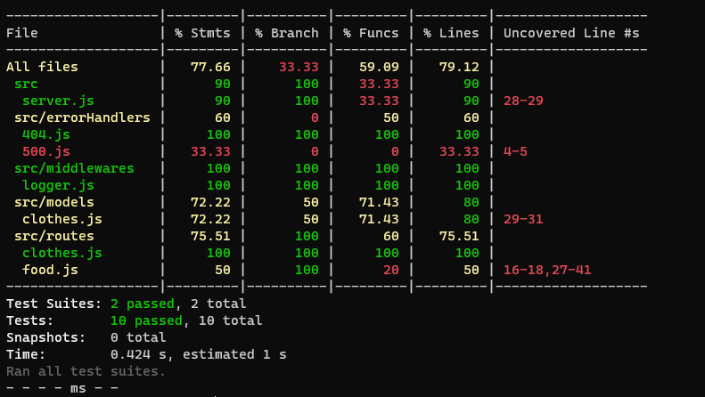
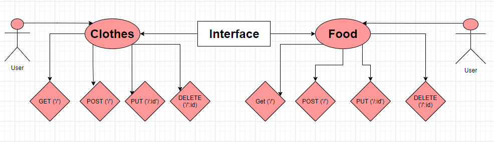

# basic-api-server

* Build a REST API using Express, by creating a proper series of endpoints that perform CRUD operations on a database, using the REST standard.

#### Feature Requierments :

1. Create two routes for Clothes and Food
2. Getting data for clothes and food
3. Add data for both routes
4. Update data
5. Delete data
 
#### From a business requirements standpoint, we will be building a basic Express server using best practices, including server modularization, use of middleware, and tests.

* [PullRequest](https://github.com/Sukina12/basic-api-server/pull/1)

* [TestReport](https://github.com/Sukina12/basic-api-server/actions)

* [deploymentURL](https://sukina-basic-api-server.herokuapp.com/)

#### Setup

* .env Requirement : PORT = 8000

#### Running The App :
1. Make new repo.
2. clone the repo.
3. npm i all packages.
4. npm start.
5. Endpoints : return Hello from Sukina message.
6. Tests : 
  * npm run test
  * npm run lint

#### UML diagram :

